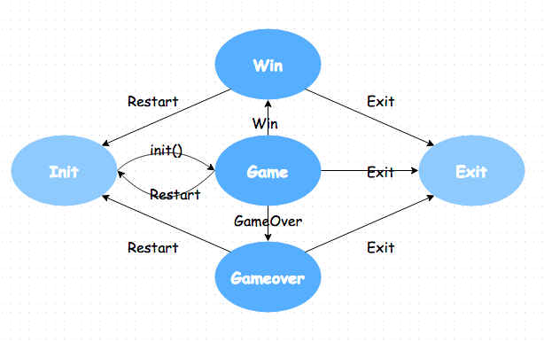

## python实现游戏2048
* 游戏玩法可以在这里亲自体验：【原版地址】[2048原版游戏地址](https://gabrielecirulli.github.io/2048/)
* 网页版2048[HTML5实现2048游戏](https://www.lanqiao.cn/courses/62)
* 实现视频[2048蓝桥云课](https://www.lanqiao.cn/courses/368)

### 说明
本次实现使用了2种方式：
* 1.2048游戏在pychram控制台中运行[简易2048小游戏](https://blog.csdn.net/uhauha2929/article/details/123588288?ops_request_misc=%257B%2522request%255Fid%2522%253A%2522167595028116782429736463%2522%252C%2522scm%2522%253A%252220140713.130102334.pc%255Fblog.%2522%257D&request_id=167595028116782429736463&biz_id=0&utm_medium=distribute.pc_search_result.none-task-blog-2~blog~first_rank_ecpm_v1~times_rank-10-123588288-null-null.blog_rank_default&utm_term=python2048%E6%B8%B8%E6%88%8F%E4%BB%A3%E7%A0%81&spm=1018.2226.3001.4450)
* 2.在命令行界面中实现
  * **注意** 不能用任何IDE来运行有curses包的python文件。 比如：在pycharm里跑的，自然跑不起来。 
  * 需要改到命令行运行：[python redirection is not supported
](https://www.cnblogs.com/ahusi/p/6656665.html) 

### 游戏实现
处理游戏主逻辑的时候会用到一种常用的技术：状态机，或者更准确的说是有限状态机（FSM）

你会发现 2048 游戏很容易就能分解成几种状态的转换。



state 存储当前状态， state_actions 这个词典变量作为状态转换的规则，它的 key 是状态，value 是返回下一个状态的函数：
* Init: init()
   * Game
* Game: game()
   * Game
   * Win
   * GameOver
   * Exit
* Win: lambda: not_game('Win')
   * Init
   * Exit
* Gameover: lambda: not_game('Gameover')
   * Init
   * Exit
* Exit: 退出循环
状态机会不断循环，直到达到 Exit 终结状态结束程序。

所有的有效输入都可以转换为"上，下，左，右，游戏重置，退出"这六种行为，用 actions 表示
* actions = ['Up', 'Left', 'Down', 'Right', 'Restart', 'Exit']

### 导入需要的包
curses 用来在终端上显示图形界面

```import curses```

random 模块用来生成随机数

```from random import randrange, choice``` 

collections 提供了一个字典的子类 defaultdict。可以指定 key 值不存在时，value 的默认值。

```from collections import defaultdict```


