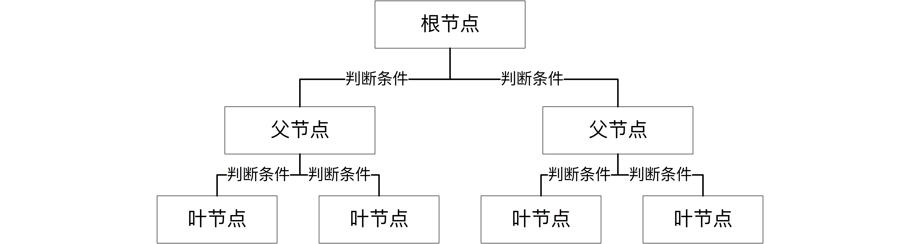
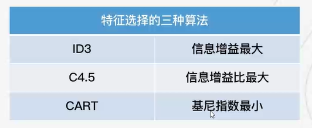
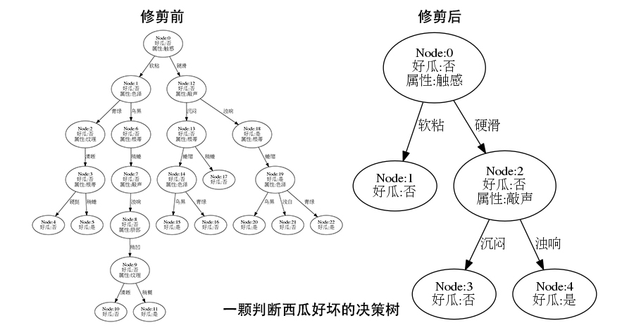
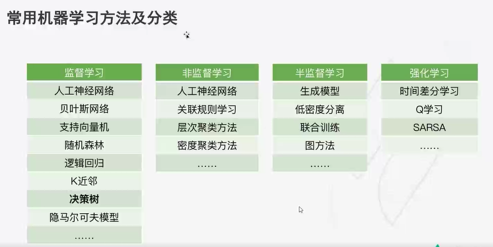

## python决策树实现鸢尾花分类【机器学习】
视频链接[决策树实现鸢尾花分类](https://www.lanqiao.cn/courses/863)

### 决策树的基本原理
**【决策树简介】**

决策树学习（Decision Tree Learning），亦简称为决策树。

决策树是一种特殊的**树形结构**，一般*由节点和有向边组成*。其中，**节点表示特征、属性或者一个类**。而有向边包含有判断条件。

如图所示，决策树从根节点开始延伸，经过不同的判断条件后，到达不同的子节点。而上层子节点又可以作为父节点被进一步划分为下层子节点。
 


一般情况下，我们从根节点输入数据，经过多次判断后，这些数据就会被分为不同的类别。这就构成了一颗简单的分类决策树。

决策树可以用来解决分类或回归问题，分别称之为分类树或回归树。其中，**分类树的输出是一个标量，而回归树的一般输出为一个实数**

### 决策树的三个步骤
决策树学习通常包含三个阶段：特征选择、树的生成、树的修剪。
* 特征选择
  * 决策树的内节点→特征
  * 决策树的叶节点→类别
  * 特征选择的三种算法：
      
      * 通常我们在选择特征时，会考虑到两种不同的指标，分别为：信息增益和信息增益比。
      * 熵（Entropy）是表示随机变量不确定性的度量。简单来讲，熵越大，随机变量的不确定性就越大。
      * 特征 A 对于某一训练集 D 的信息增益 g(D,A) 定义为集合 D 的熵 H(D) 与特征 A 在给定条件下 D 的熵 
  H(D/A) 之差。
      * g(D,A) =  H(D) - H(D/A)
      * 简单来讲，每一个特征针对训练数据集的前后信息变化的影响是不一样的，信息增益越大，即代表这种影响越大。而影响越大，就表明该特征更加重要。

* 树的生成
  * 最经典的就数 John Ross Quinlan 提出的 ID3 算法，这个算法的核心理论即源于上面提到的信息增益。
  * ID3 算法通过递归的方式建立决策树。建立时，从根节点开始，对节点计算每个独立特征的信息增益，选择信息增益最大的特征作为节点特征。接下来，对该特征施加判断条件，建立子节点。然后针对子节点再此使用信息增益进行判断，直到所有特征的信息增益很小或者没有特征时结束，这样就逐步建立一颗完整的决策树。
  * 除了从信息增益演化而来的 ID3 算法，还有一种常见的算法叫 C4.5。C4.5 算法同样由 John Ross Quinlan 发明，但它使用了信息增益比来选择特征，这被看成是 ID3 算法的一种改进。 ID3 和 C4.5 算法简单高效，但是他俩均存在一个缺点，那就是用 “完美去造就了另一个不完美”。这两个算法从信息增益和信息增益比开始，对整个训练集进行的分类，拟合出来的模型针对该训练集的确是非常完美的。但是，这种完美就使得整体模型的复杂度较高，而对其他数据集的预测能力就降低了，也就是我们常说的过拟合而使得模型的泛化能力变弱。
  * 当然，过拟合的问题也是可以解决的，那就是对决策树进行修剪。

* 树的修剪
  * 决策树的修剪，其实就是通过优化损失函数来去掉不必要的一些分类特征，降低模型的整体复杂度。
  * 修剪的方式，就是从树的叶节点出发，向上回缩，逐步判断。如果去掉某一特征后，整棵决策树所对应的损失函数更小，那就就将该特征及带有的分支剪掉。
  * 
  * 由于 ID3 和 C4.5 只能生成决策树，而修剪需要单独进行，这也就使得过程更加复杂了。1984 年，Breiman 提出了 CART 算法，使这个过程变得可以一步到位。CART 算法本身就包含了决策树的生成和修剪，并且可以同时被运用到分类树和回归树。这就是和 ID3 及 C4.5 之间的最大区别
  * CART 算法在生成树的过程中，分类树采用了基尼指数（Gini Index）最小化原则，而回归树选择了平方损失函数最小化原则。基尼指数其实和前面提到的熵的概念是很相似的。简单概述区别的话，就是数值相近但不同，而基尼指数在运算过程中的速度会更快一些
  * CART 算法也包含了树的修剪。CART 算法从完全生长的决策树底端剪去一些子树，使得模型更加简单。而修剪这些子树时，是每次去除一颗，逐步修剪直到根节点，从而形成一个子树序列。最后，对该子树序列进行交叉验证，再选出最优的子树作为最终决策树

### 数据集简介
数据集名称的准确名称为 Iris Data Set，总共包含 150 行数据。每一行数据由 4 个特征值及一个目标值组成。其中 4 个特征值分别为：萼片长度、萼片宽度、花瓣长度、花瓣宽度。而目标值及为三种不同类别的鸢尾花，分别为：Iris Setosa，Iris Versicolour，Iris Virginica。

**数据获取及划分**

你可以通过著名的 UCI 机器学习数据集网站下载该数据集 [DataSets](https://archive.ics.uci.edu/ml/datasets/Iris)。

本实验中，为了更加便捷地实验。我们直接实验 scikit-learn 提供的方法导入该数据集即可。

**数据展示注意**

1.导入graphviz错误可查看以下链接： [graphviz安装及使用](https://blog.csdn.net/weixin_45361362/article/details/121350501?ops_request_misc=%257B%2522request%255Fid%2522%253A%2522167628373316782429792119%2522%252C%2522scm%2522%253A%252220140713.130102334..%2522%257D&request_id=167628373316782429792119&biz_id=0&utm_medium=distribute.pc_search_result.none-task-blog-2~blog~sobaiduend~default-1-121350501-null-null.blog_rank_default&utm_term=import%20graphviz%E9%94%99%E8%AF%AF&spm=1018.2226.3001.4450)
[Anaconda搭建Graphviz环境以及Sklearn的应用](https://blog.csdn.net/qq_40212676/article/details/107916910?ops_request_misc=&request_id=&biz_id=102&utm_term=pycharm%20graphviz.Source()%E5%86%B3%E7%AD%96%E6%A0%91%E4%BF%9D%E5%AD%98&utm_medium=distribute.pc_search_result.none-task-blog-2~blog~sobaiduweb~default-3-107916910.blog_rank_default&spm=1018.2226.3001.4450)

2.graphviz中文字体乱码问题[graphviz绘制决策树时，决策树图片中不显示中文(中文字体乱码！！)](https://blog.csdn.net/qq_45261963/article/details/119948479?ops_request_misc=%257B%2522request%255Fid%2522%253A%2522167628438616800211518244%2522%252C%2522scm%2522%253A%252220140713.130102334.pc%255Fblog.%2522%257D&request_id=167628438616800211518244&biz_id=0&utm_medium=distribute.pc_search_result.none-task-blog-2~blog~first_rank_ecpm_v1~rank_v31_ecpm-5-119948479-null-null.blog_rank_default&utm_term=pycharm%20graphviz&spm=1018.2226.3001.4450)

3.Pycharm生成决策树并保存[决策树保存问题](https://blog.csdn.net/qq_55342245/article/details/120417846?ops_request_misc=%257B%2522request%255Fid%2522%253A%2522167628537616800217014124%2522%252C%2522scm%2522%253A%252220140713.130102334.pc%255Fblog.%2522%257D&request_id=167628537616800217014124&biz_id=0&utm_medium=distribute.pc_search_result.none-task-blog-2~blog~first_rank_ecpm_v1~rank_v31_ecpm-2-120417846-null-null.blog_rank_default&utm_term=pycharm%20graphviz.Source%28%29%E5%86%B3%E7%AD%96%E6%A0%91%E4%BF%9D%E5%AD%98&spm=1018.2226.3001.4450)

4.利用graphviz来将dot转成pdf的树状图的方法
* [方法一，graphviz将dot转成pdf](https://blog.csdn.net/jingsiyu6588/article/details/88966820?ops_request_misc=%257B%2522request%255Fid%2522%253A%2522167628584416800217030485%2522%252C%2522scm%2522%253A%252220140713.130102334.pc%255Fblog.%2522%257D&request_id=167628584416800217030485&biz_id=0&utm_medium=distribute.pc_search_result.none-task-blog-2~blog~first_rank_ecpm_v1~rank_v31_ecpm-1-88966820-null-null.blog_rank_default&utm_term=graphviz%E4%B8%ADdot%E8%BD%AC%E5%8C%96pdf&spm=1018.2226.3001.4450)

* [方法二：保存为PDF、png格式](https://blog.csdn.net/fffsolomon/article/details/106874318?ops_request_misc=%257B%2522request%255Fid%2522%253A%2522167628610016800222892383%2522%252C%2522scm%2522%253A%252220140713.130102334..%2522%257D&request_id=167628610016800222892383&biz_id=0&utm_medium=distribute.pc_search_result.none-task-blog-2~blog~sobaiduend~default-1-106874318-null-null.blog_rank_default&utm_term=Source.gv&spm=1018.2226.3001.4450)

``` dot -Tpng E:\Python_Experienment_Project\ex_04\Source.gv -o E:\Python_Experienment_Project\ex_04\tree.png```


### 常见的机器学习分类
