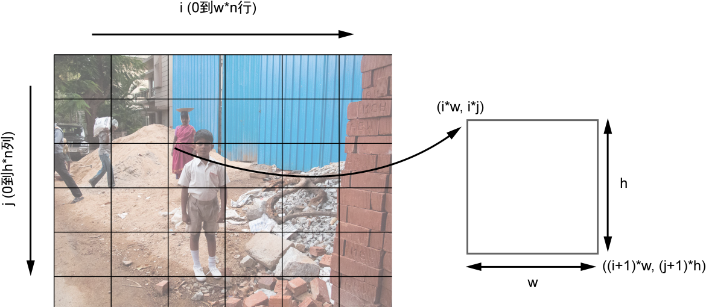

## 使用 Python 创建照片马赛克

课程视频链接[Python 创建马赛克照片](https://www.lanqiao.cn/courses/1041)

介绍：我们将目标图像划分成较小图像的网格，并用适当的图像替换网格中的每一小块，创建原始图像的照片马赛克。你可以指定网格的尺寸，并选择输入图像是否可以在马赛克中重复使用。

### 实验原理

要创建照片马赛克，就从目标图像的块状低分辨率开始（因为在高分辨率的图像中，小块图像的数量会太大）。该图像的分辨率将决定马赛克的维度 M∗N
（M 是行数，N 是列数）。

接着，根据这种方法替换原始图像中的每一小块：
* 1.读入一些小块图像，他们将取代原始图像中的小块；
* 2.读入目标图像，将他们分割成 M∗N 的小块网格；
* 3.对于目标图像中的每个小块，从输入的小块图像中找到最佳匹配；
* 4.将选择的输入图像安排在 M∗N 的网格中，创建最终的照片马赛克。

按照下图中的方案，开始将目标图像划分成 M∗N 的网格:

上图中的图像展示了如何将原始图像分割成小块的网格。x 轴表示网格的列，y 轴表示网格的行。

**注意，上图中 i 和 j 的取值范围应该分别是“0到n列”和“0到m行”。**

如何计算网格中一个小块的坐标:

下标为(i,j)的小块，左上角坐标为
(i*w,j*h),右下角的坐标为((i+1)*w,(j+1)*h)

### 项目文件结构
本实验包括一个 .py 文件和若干图片组成，所有的图片都放置在 /labfile_image文件夹下，/labfile_image/a.jpg 是目标图像，/labfile_image/set1/ 文件夹下存放的是小块图像。